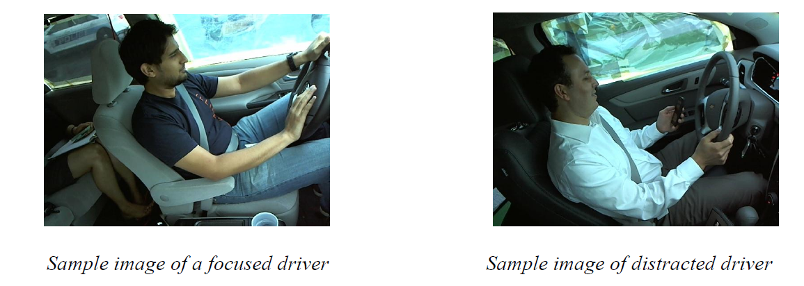

# Distracted_Driver_Detection

This project aims to build a deep learning model capable of detecting drivers who are distracted. The dataset used has been purpose-built and was published to Kaggle by State Farm Insurance. The published dataset contains images of drivers seated at the steering wheel of a car, exhibiting various behaviours. Some of these behaviours are negligent and dangerous, and we have assigned them to a set labelled ‘distracted’.

## Significance
As of July 26th, this year Queensland introduced some of the most severe penalties for using
or touching a mobile phone while driving in Australia. This follows an announcement from the
Queensland Department of Transport and Main Roads (2021) that distracted drivers caused an annual
average of 29 deaths and 1284 hospitalisations in Queensland between the years 2015 and 2019.
Developing an automated deep learning approach capable of processing image data, could help
enhance the capabilities of the existing, newly implemented, driver monitoring technology.
Additionally, it could also influence future hardware installation decisions. 

## Feasibility
While it may be difficult to detect certain forms of distraction, such as driver fatigue or
absent-mindedness, other forms of driver distraction, like texting on a mobile phone, are more explicit
and therefore easier to detect.

## Data Specification
The dataset used contains over 22,000 labelled colour photos of 81 different individuals
driving a variety of vehicles, performing 10 different tasks. We have decided to approach this as a task
of binary classification, so we assigned each task to one of two categories; distracted, or focused.
Examples of tasks in the distracted category include using one's phone, or reaching for items on the
backset, whereas examples of tasks not considered to be distracting include operating the car’s radio
or talking to a passenger.

## Model Building
The dataset consists of 22,000 labelled images which were grouped by us into two classes
i.e., focussed, and distracted drivers. Each class consists of 11,000 images
and due to this balanced nature of the dataset, the metric that was chosen to
evaluate the model was "accuracy". 

The dataset contains images of 81 individuals doing various tasks and
these images were split randomly into 3 parts. That is, 70% of the dataset was
used for training the model, 20% of the dataset was used for Validating the
model to tune hyper-parameters and the rest 10% was used as test data to check
the final accuracy of the model on unseen data.

## Data Specification
The dataset used contains over 22,000 labelled colour photos of 81 different individuals
driving a variety of vehicles, performing 10 different tasks. We have decided to approach this as a task
of binary classification, so we assigned each task to one of two categories; distracted, or focused.
Examples of tasks in the distracted category include using one's phone, or reaching for items on the
backset, whereas examples of tasks not considered to be distracting include operating the car’s radio
or talking to a passenger.

## Model Building
The dataset consists of 22,000 labelled images which were grouped by us into two classes
i.e., focussed, and distracted drivers. Each class consists of 11,000 images
and due to this balanced nature of the dataset, the metric that was chosen to
evaluate the model was "accuracy". 

The dataset contains images of 81 individuals doing various tasks and
these images were split randomly into 3 parts. That is, 70% of the dataset was
used for training the model, 20% of the dataset was used for Validating the
model to tune hyper-parameters and the rest 10% was used as test data to check
the final accuracy of the model on unseen data.

We used TensorFlow Keras to implement our model with pre-trained weights of VGG16 and ResNet50 on the
ImageNet dataset. We used data augmentation as a regularization technique which
help reduce overfitting. This technique introduces slightly modified versions
of existing images during training phase. The output of the two transfer
learning models is connected to 2 final layers, namely, the dense layer with
1024 nodes having 'Relu' activation and the output layer with 2 nodes
representing 2 classes i.e., distracted, and focussed class. For the output
layer, SoftMax is used as an activation function. The models are built with
'adam' optimizer and the loss function used is categorical cross-entropy loss. 

**The final accuracy of ResNet50 is over 78% and for VGG16 it is 99.33%.**

## Potential Applications
The output of this project could potentially be used to enhance the existing systems that have
been implemented by the Department of Transport and Main Roads QLD. This could enhance the
accuracy of roadside cameras, identify additional cases of driver distraction, and make the task of
driver monitoring less labour intensive. Additionally, this technology could be used to enhance
physical police surveillance and compliance via the use of discrete image processing units fitted to
their vehicles. Used in this way, the technology could help police drivers remain focused on their own
driving, and collect evidence of misconduct at the same time. A benefit of this technology is that a
trained model can function offline and process photos without storing them for human observation, so
this point may address privacy and ethical considerations that one may anticipate.
There are also many futuristic, and perhaps, controversial applications of our project within
the commercial transit and insurance sectors, in which the driving behaviour of employees, or
customers, could be autonomously monitored to determine suggested commercial relationships.
